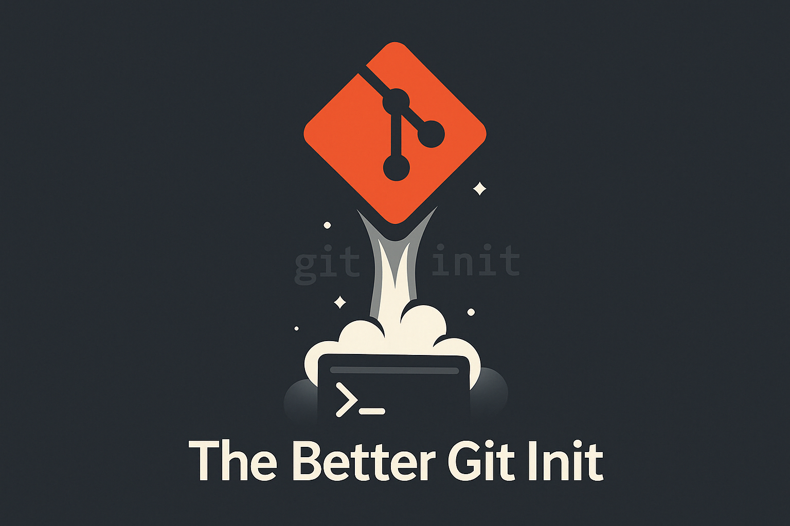

# The Better Git Init

A Bash CLI tool that bootstraps a local Git repository **and** creates a matching GitHub repo in one step.




## Features

- Initializes a local Git repository (if not already initialized)
- Creates a corresponding GitHub repository under your account
- Supports **public** or **private** repos
- Custom repository description via `-d|--description`
- Idempotent: detects and updates existing `origin` remote
- No default README/License

## Requirements

- **Bash**
- **curl**
- **git**
- **[jq](https://jqlang.org/)**
- A GitHub **fine-grained Personal Access Token**
  - The **fine-grained** token must have the following permission set:
    - "Administration" repository permissions (write)
    - **Classic personal access tokens are not supported.**
  - See [GitHub docs on creating a fine‑grained PAT](https://docs.github.com/en/authentication/keeping-your-account-and-data-secure/managing-your-personal-access-tokens#creating-a-fine-grained-personal-access-token) for instructions.
    - stored in a `.env` file at the project root:
    ```bash
    PERSONAL_ACCESS_TOKEN=yourFineGrainedTokenHere
    ```
- Linux/MacOS (no support for windows)

## Installation

1. Clone this repository:
   ```bash
   git clone https://github.com/VincentVanCode101/the-better-git-init.git
   cd the-better-git-init
   ```
2. Create a `.env` file in the project root and add your GitHub token:
   ```bash
   echo "PERSONAL_ACCESS_TOKEN=yourTokenHere" > .env
   ```
3. Install the binary:
   ```bash
   ./install.sh
   ```
  - Linux: the binary is automatically added to `/usr/local/bin/the_better_git_init`
  - MacOS: the binary is automatically added to `/opt/homebrew/bin/the_better_git_init`


## Usage

```bash
$ the_better_git_init [OPTIONS]
```

### Options

- `-h, --help`               	Show this help message and exit
- `--private`               	Create a **private** GitHub repository
- `-d, --description <desc>`	Set the repository description (must be quoted if it contains spaces)

### Examples

- **Create a new public repo** in the current directory:
  ```bash
  the_better_git_init
  ```

- **Create a private repo**:
  ```bash
  the_better_git_init --private
  ```

- **Add a description**:
  ```bash
  the_better_git_init -d "Just a test project"
  ```

- **Private + description**:
  ```bash
  the_better_git_init --private --description="Secret project"
  ```

## How It Works

1. Parses flags (`--private`, `-d|--description`).
2. Derives the repo name from the current directory name (lowercased, non-alphanumerics → `-`).
3. Builds a JSON payload with `jq`.
4. Calls the GitHub API (`curl`) to create the repo.
5. Initializes `git` (if needed) and adds/updates the `origin` remote.

## Contributing

Feel free to submit issues or pull requests for enhancements and bug fixes.
See [todos.md](./todos.md).

## License

Licensed under [MIT License](./LICENSE)